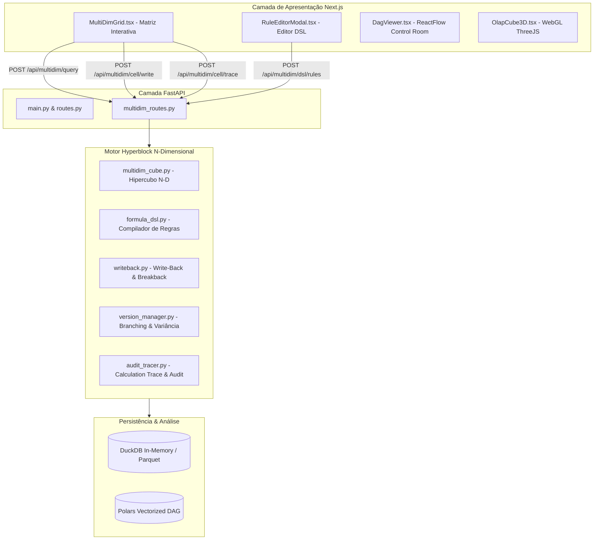

# Ponto de Retorno: Arquitetura Enterprise Connected Planning (Paridade Anaplan / IBM TM1)

**Data do Checkpoint:** 13 de Agosto de 2026  
**Versão do Motor:** Hyperblock Engine v3.0 (Enterprise Connected Planning)  
**Status dos Testes:** 13/13 Testes Unitários e de Integração Aprovados (`pytest`)  
**Status do Frontend:** Compilação de Produção Next.js 15 Aprovada (`npm run build`)  

---

## 1. Visão Geral da Transformação Arquitetural

Este documento serve como **ponto de restauração e referência técnica** da evolução do HyperCube de um demonstrativo bi-dimensional para uma **plataforma corporativa de Connected Planning multidimensional ($N$-Dimensional Tensor)**, operando sob os mesmos princípios do **Anaplan** e **IBM Cognos TM1**.



---

## 2. Os 8 Pilares Implementados

### 1. Modelagem Multidimensional Real ($N$-Dimensional Tensor)
* **Arquivo:** [`backend/app/engine/multidim_cube.py`](file:///c:/Users/edumo/HyperCube/backend/app/engine/multidim_cube.py)
* **Espaço de Coordenadas:** 
  $$\text{Célula} = (\text{Time} \times \text{Version} \times \text{Scenario} \times \text{Entity} \times \text{Account} \times \text{Product})$$
* **Hierarquias Nativas & Roll-Ups Dinâmicos:**
  * `Time`: Meses $\rightarrow$ Trimestres (Q1..Q4) $\rightarrow$ Anos (2024, 2025, 2026).
  * `Entity`: Filiais (Branch_SP, Branch_RJ, Branch_PR, Branch_BA) $\rightarrow$ Regiões (Sudeste, Sul, Norte/NE) $\rightarrow$ Total Empresa.
  * `Product`: Varejo Físico, E-Commerce, B2B Corporativo $\rightarrow$ Total Produtos.
  * `Version`: Realizado (Actuals), Orçamento 2026 (Budget_2026), Forecast Q1, Stress Test.
  * `Scenario`: Base, Otimista (+10%), Pessimista (-15%).
  * `Account`: Contas contábeis canônicas de DRE/DFC.

### 2. DSL Declarativa de Fórmulas (Anaplan Rule Engine)
* **Arquivo:** [`backend/app/engine/formula_dsl.py`](file:///c:/Users/edumo/HyperCube/backend/app/engine/formula_dsl.py) e [`frontend/components/RuleEditorModal.tsx`](file:///c:/Users/edumo/HyperCube/frontend/components/RuleEditorModal.tsx)
* **Compilador AST Seguro:** Avaliação sem `eval()` inseguro, suportando:
  * Referências a contas entre colchetes: `[Conta]`
  * Operações aritméticas: `+`, `-`, `*`, `/`
  * Condicionais: `IF [EBT] > 0 THEN [EBT] * 0.34 ELSE 0`
* **Ordenação Topológica:** Algoritmo de Kahn para resolução automática da ordem de recálculo causal do DAG.

### 3. Write-Back Granular por Célula & Breakback (Top-Down Spread)
* **Arquivo:** [`backend/app/engine/writeback.py`](file:///c:/Users/edumo/HyperCube/backend/app/engine/writeback.py)
* **Edição de Células Folha:** Escrita direta com disparo instantâneo do recálculo topológico dos nós calculados a jusante.
* **Breakback em Células Consolidadas:** Ao editar um nó pai (ex: Ano 2026 ou Total Empresa):
  * `proportional`: Distribui proporcionalmente com base na fatia histórica de cada filho.
  * `equal`: Distribui em partes iguais.
* **Performance:** Tempo de transação medido em **~4 milissegundos**.

### 4. Versionamento, Branching & Análise de Variância (Variance Analysis)
* **Arquivo:** [`backend/app/engine/version_manager.py`](file:///c:/Users/edumo/HyperCube/backend/app/engine/version_manager.py)
* **Clonagem e Branching de Versões:** Criação de novos cenários isolados a partir de versões base com aplicação de multiplicador de choque/crescimento.
* **Comparativo de Variância:** Modo comparativo lado a lado calculando $\Delta \text{ R\$}$ e $\% \text{ Var}$ com classificação de status (Favorável / Desfavorável).

### 5. Calculation Trace & Auditoria de Célula (Observabilidade)
* **Arquivo:** [`backend/app/engine/audit_tracer.py`](file:///c:/Users/edumo/HyperCube/backend/app/engine/audit_tracer.py)
* **Transparência de Cálculo:**
  * Identificação do tipo da célula (Premissa / Fórmula / Consolidação).
  * Exibição da fórmula DSL compilada.
  * Tabela com o valor de cada célula precedente na árvore de cálculo.
  * Decomposição percentual de contribuição das fatias filhas.
* **Audit Trail:** Registro histórico de quem alterou cada célula, quando, valor anterior, novo valor e método de spread.

### 6. Grid Matricial Interativo de Connected Planning (Frontend)
* **Arquivo:** [`frontend/components/MultiDimGrid.tsx`](file:///c:/Users/edumo/HyperCube/frontend/components/MultiDimGrid.tsx)
* Barra de fatiamento multidimensional (*Time, Version, Scenario, Entity, Product*).
* Células editáveis inline com clique duplo.
* Modal inteligente de Breakback.
* Inspetor de Calculation Trace integrado.
* Alternador para Análise de Variância (*Budget vs Actuals*).
* Editor visual de regras DSL.

---

## 3. Mapeamento de Arquivos do Projeto

| Arquivo | Camada | Descrição |
| :--- | :--- | :--- |
| `backend/app/engine/multidim_cube.py` | Backend Engine | Motor do Hipercubo $N$-Dimensional e roll-ups |
| `backend/app/engine/formula_dsl.py` | Backend Engine | Compilador e avaliador da DSL de fórmulas Anaplan |
| `backend/app/engine/writeback.py` | Backend Engine | Motor de Write-Back, Breakback e recálculo reativo |
| `backend/app/engine/version_manager.py` | Backend Engine | Gestor de ciclo de vida de versões e análise de variância |
| `backend/app/engine/audit_tracer.py` | Backend Engine | Rastreamento de linhagem de cálculo e histórico de auditoria |
| `backend/app/api/multidim_routes.py` | Backend API | Endpoints REST para fatiamento, escrita, trace e regras |
| `backend/app/main.py` | Backend API | Registro dos roteadores FastAPI |
| `backend/tests/test_multidim.py` | Testes | Suíte de 6 testes cobrindo todo o motor multidimensional |
| `frontend/components/MultiDimGrid.tsx` | Frontend UI | Grid matricial editável estilo Anaplan |
| `frontend/components/RuleEditorModal.tsx` | Frontend UI | Modal do editor de regras DSL |
| `frontend/components/PreferencesContext.tsx` | Frontend Core | Suporte a internacionalização (PT/EN) |
| `frontend/app/page.tsx` | Frontend Core | Layout principal com aba Connected Planning |
| `frontend/app/not-found.tsx` | Frontend Core | Rota 404 para compilação Next.js 15 |

---

## 4. Endpoints REST da API Multidimensional

* `GET /api/multidim/dimensions`: Retorna os membros e hierarquias das 6 dimensões.
* `POST /api/multidim/query`: Executa consulta Pivot 2D com filtros de fatiamento.
* `POST /api/multidim/cell/write`: Executa gravação de valor por célula com Breakback e recálculo topológico.
* `POST /api/multidim/cell/trace`: Retorna a árvore de precedentes e fórmula da célula selecionada.
* `GET /api/multidim/versions`: Lista versões e cenários cadastrados.
* `POST /api/multidim/versions/clone`: Cria um branch/clone de versão com multiplicador.
* `POST /api/multidim/variance`: Retorna análise de variância entre duas versões.
* `GET /api/multidim/dsl/rules`: Lista as fórmulas ativas e a ordem topológica.
* `POST /api/multidim/dsl/rules`: Adiciona/atualiza uma regra declarativa em tempo de execução.
* `GET /api/multidim/audit/history`: Retorna o log de auditoria de alterações em células.

---

## 5. Como Executar e Validar o Ponto de Retorno

### 1. Executar Testes Automatizados
```bash
python -m pytest backend/tests
```
*Resultado esperado:* `13 passed in ~1.2s`

### 2. Validar Build de Produção do Frontend
```bash
cd frontend
npm run build
```
*Resultado esperado:* `✓ Compiled successfully` e `Generating static pages (5/5)`

### 3. Iniciar Servidores de Desenvolvimento
* **Backend:**
  ```bash
  python -m uvicorn backend.app.main:app --port 8000 --host 127.0.0.1
  ```
* **Frontend:**
  ```bash
  cd frontend
  npm run dev
  ```
* **Acesso:** `http://localhost:3000` (Aba *Connected Planning ($N$-D)* na barra lateral).
