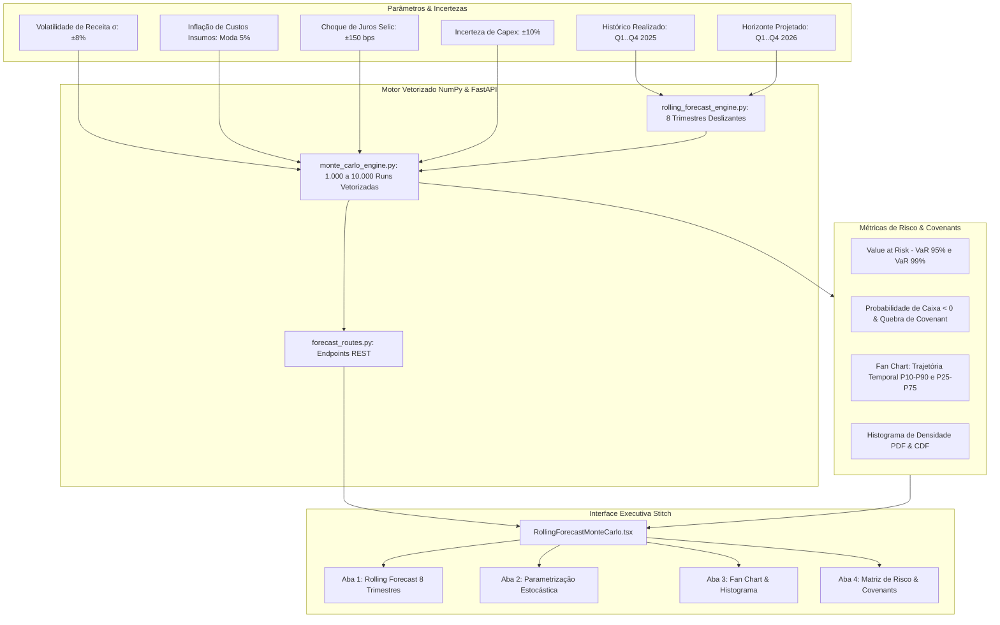

# Checkpoint — Etapa 4: Previsão Contínua & Simulação Estocástica (Rolling Forecast & Monte Carlo)

**Data do Checkpoint:** 13 de Agosto de 2026  
**Status do Backend:** 67/67 Testes Unitários e de Integração Aprovados (`pytest`)  
**Status do Frontend:** Compilação de Produção Next.js 15 Aprovada (`npm run build` em 6.1s)  
**Padrão Visual:** Stitch Dark Fintech (Bloomberg Terminal / Anaplan / Pigment)

---

## 1. Visão Geral da Etapa 4

A **Etapa 4** eleva o HyperCube da modelagem determinística estática para o padrão de planejamento contínuo e quantificação estocástica de risco das maiores corporações e bancos de investimento globais.

---

## 2. Componentes Criados & Arquitetura

### 1. Motor de Previsão Contínua (`RollingForecastEngine`)
* **Arquivo:** [`backend/app/engine/rolling_forecast_engine.py`](file:///c:/Users/edumo/HyperCubo_final2/backend/app/engine/rolling_forecast_engine.py)
* **Horizonte Móvel de 8 Trimestres**:
  * 4 Trimestres Realizados (Actuals 2025): Q1, Q2, Q3, Q4 com pesos de sazonalidade corporativa (22%, 24%, 26%, 28%).
  * 4 Trimestres Projetados (Forecast 2026): Q1, Q2, Q3, Q4 dinamicamente acoplados ao `ThreeStatementEngine`.
* **Continuidade Causal de Caixa**:
  $$\text{Caixa Inicial}(Q_{t+1}) = \text{Caixa Final}(Q_t)$$
  $$\Delta \text{Caixa} = \text{FCO} + \text{FCI} + \text{FCF}$$
* **Ponto de Corte Dinâmico (*Cut-Off Date*)**: Transição explícita entre dados auditados fechados e estimativas móveis.

### 2. Motor Estocástico de Monte Carlo (`MonteCarloEngine`)
* **Arquivo:** [`backend/app/engine/monte_carlo_engine.py`](file:///c:/Users/edumo/HyperCubo_final2/backend/app/engine/monte_carlo_engine.py)
* **Vetorização NumPy $(N \times 4)$**:
  * Simula de 1.000 a 10.000 iterações em menos de 150 milissegundos sem laços imperativos.
* **Distribuições de Incerteza**:
  * **Receita / Volume**: Normal $\mathcal{N}(1.0, \sigma^2)$
  * **Custos Fabris / CPV**: Triangular $[\text{Min}, \text{Moda}, \text{Max}]$
  * **Taxa Selic / Juros**: Normal $\mathcal{N}(0, \sigma_{selic}^2)$ em pontos-base (bps)
  * **Cronograma / Execução de Capex**: Triangular com assimetria à direita
* **Métricas Geradas**:
  * **Value at Risk (VaR 95% e VaR 99%)**: Shortfall máximo provável na cauda esquerda de 5% e 1%.
  * **Probabilidades de Cauda**: $P(\text{Caixa} < \text{R\$} 150\text{M})$ e $P(\text{Alavancagem} > 3,5\times)$.
  * **Percentis Completos**: P1, P5, P10, P25, P50 (Mediana), P75, P90, P95, P99.
  * **Fan Chart Temporal**: Bandas de confiança P10-P90 (80%) e P25-P75 (50%) para cada trimestre.
  * **Histogramas de Frequência**: 30 bins calibrados com densidade e probabilidade acumulada (CDF).

### 3. Rotas REST FastAPI
* **Arquivo:** [`backend/app/api/forecast_routes.py`](file:///c:/Users/edumo/HyperCubo_final2/backend/app/api/forecast_routes.py)
* `GET /api/financials/forecast/companies`: Lista empresas corporativas calibradas.
* `GET /api/financials/forecast/rolling`: Retorna o dataset dos 8 trimestres contínuos.
* `POST /api/financials/forecast/monte-carlo`: Executa a simulação estocástica e retorna todas as métricas de risco.

### 4. Interface Executiva Stitch (`RollingForecastMonteCarlo.tsx`)
* **Arquivo:** [`frontend/components/RollingForecastMonteCarlo.tsx`](file:///c:/Users/edumo/HyperCubo_final2/frontend/components/RollingForecastMonteCarlo.tsx)
* **Design System**: Paleta Dark Slate Fintech (`#0b1326`, `#131b2e`, `#222a3d`), `font-mono tabular-nums`, acentos Sky Blue (`#38bdf8`) e Emerald (`#52e87c`).
* **4 Abas Analíticas**:
  1. **Rolling Forecast (8 Trimestres)**: Tabela de alta densidade financeira com linha de corte visual.
  2. **Parametrização Estocástica**: Sliders interativos de sensibilidade e incerteza.
  3. **Fan Chart & Histograma**: Gráficos vetoriais SVG de dispersão temporal e densidade de EBITDA e Caixa.
  4. **Matriz de Risco & Covenants**: Tabela de percentis, VaR e teste de liquidez Fleuriet.

---

## 3. Resultados dos Testes

1. **Bateria Pytest Completa**:
   * Arquivo de testes dedicado: `backend/tests/test_rolling_forecast_monte_carlo.py` (10 novos testes).
   * **67 de 67 testes passaram com 100% de aprovação**:
     * Teste de continuidade temporal de caixa: $\Delta = 0,00$ entre trimestres.
     * Monotonicidade estrita de percentis: $P_1 \le P_5 \le P_{10} \le P_{25} \le P_{50} \le P_{75} \le P_{90} \le P_{95} \le P_{99}$.
     * Integridade dos bins do histograma: somatório de frequências $= N$.
     * Convergência estocástica em 1.000, 3.000 e 5.000 iterações.
2. **Compilação de Produção Next.js**:
   * `next build` executado em **6.1s sem nenhum erro de tipagem ou webpack**.
