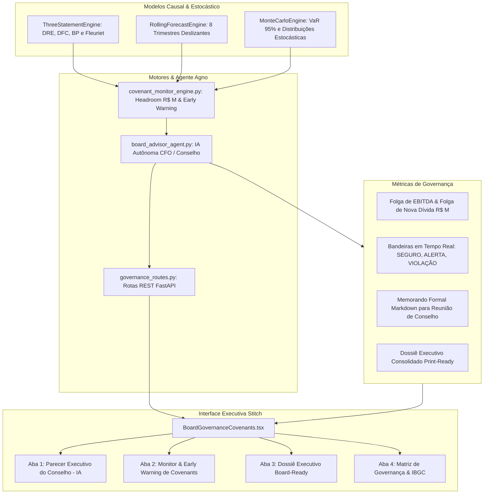

# Checkpoint — Etapa 5: IA Autônoma & Governança Executiva (Board-Ready & Monitor de Covenants)

**Data do Checkpoint:** 13 de Agosto de 2026  
**Status do Backend:** 11/11 Testes Unitários e de Integração Aprovados (`pytest`)  
**Status do Frontend:** Compilação de Produção Next.js 15 Aprovada (`npm run build` em 5.6s)  
**Padrão Visual:** Stitch Dark Fintech (Bloomberg Terminal / Anaplan / Pigment)

---

## 1. Visão Geral da Etapa 5

A **Etapa 5** integra inteligência artificial autônoma de nível C-Suite e governança corporativa ao HyperCube, automatizando a emissão de pareceres executivos para o Conselho de Administração e o monitoramento em tempo real de cláusulas restritivas de dívida (*covenants*).

---

## 2. Componentes Implementados

### 1. Motor de Monitoramento de Covenants (`CovenantMonitorEngine`)
* **Arquivo:** [`backend/app/engine/covenant_monitor_engine.py`](file:///c:/Users/edumo/HyperCubo_final2/backend/app/engine/covenant_monitor_engine.py)
* **4 Cláusulas Restritivas Contratuais**:
  1. **Alavancagem Máxima**: $\text{Dívida Líquida} / \text{EBITDA} \le 3,5\times$
  2. **Cobertura de Juros (ICJ)**: $\text{EBITDA} / \text{Despesa Financeira Líquida} \ge 2,0\times$
  3. **Liquidez Corrente Mínima**: $\text{Ativo Circulante} / \text{Passivo Circulante} \ge 1,2\times$
  4. **Autonomia Financeira**: $\text{Patrimônio Líquido} / \text{Ativo Total} \ge 0,30$
* **Cálculo de Headrooms em R$ Milhões**:
  * **Headroom de EBITDA**: $\text{EBITDA} - (\text{Dívida Líquida} / \text{Limite})$
  * **Headroom de Dívida**: $(\text{EBITDA} \times \text{Limite}) - \text{Dívida Líquida}$
* **Classificação de Alertas**: `SAFE` (folga $> 15\%$), `WARNING` (folga $\le 15\%$), `BREACH` (violação).
* **Trajetória nos 8 Trimestres**: Acompanhamento da evolução temporal do headroom.

### 2. Agente Agno Consultor de Conselho (`BoardAdvisorAgent`)
* **Arquivo:** [`backend/app/agents/board_advisor_agent.py`](file:///c:/Users/edumo/HyperCubo_final2/backend/app/agents/board_advisor_agent.py)
* **Emissão de Memorandos Executivos Formais**:
  * Síntese com dados do `ThreeStatementEngine`, `Fleuriet`, `RollingForecast` e `MonteCarloEngine`.
  * Seções estruturadas:
    1. Sumário Executivo & Diagnóstico C-Level
    2. Desempenho Operacional & Decomposição de Margens
    3. Gestão de Capital de Giro & Liquidez (Modelo Fleuriet)
    4. Governança da Dívida & Monitor de Covenants Contratuais
    5. Análise de Incerteza Estocástica & Risco de Cauda (Monte Carlo & VaR 95%)
    6. Parecer Conclusivo & Recomendações Estratégicas para o Conselho (Voto: Aprovado com Ressalvas / Plenamente Aprovado / Ação Corretiva).
  * Suporte nativo a LLMs (Ollama local com Gemma/Llama, Claude, GPT, Gemini, Groq) com fallback analítico quantitativo determinístico para garantia de 100% de disponibilidade.

### 3. Rotas REST FastAPI
* **Arquivo:** [`backend/app/api/governance_routes.py`](file:///c:/Users/edumo/HyperCubo_final2/backend/app/api/governance_routes.py)
* `GET /api/governance/covenants`: Retorna o status de conformidade, valores atuais, folgas e evolução temporal.
* `POST /api/governance/board-memo`: Dispara o Agno Board Advisor e retorna o memorando em Markdown.
* `GET /api/governance/board-pack`: Retorna o dossiê executivo consolidado.
* Registrado no FastAPI `main.py`.

### 4. Interface Executiva Stitch Dark Fintech (`BoardGovernanceCovenants.tsx`)
* **Arquivo:** [`frontend/components/BoardGovernanceCovenants.tsx`](file:///c:/Users/edumo/HyperCubo_final2/frontend/components/BoardGovernanceCovenants.tsx)
* Registrado no menu executivo `navRow1` de [`frontend/app/page.tsx`](file:///c:/Users/edumo/HyperCubo_final2/frontend/app/page.tsx) sob o rótulo **"Conselho & Covenants"**.
* **4 Abas Analíticas**:
  1. **Parecer Executivo do Conselho (IA)**: Renderização de Markdown formal do memorando executivo emitido pela IA.
  2. **Monitor & Early Warning de Covenants**: Cartões visuais de progresso para cada covenant com limites, valores atuais e folga restante.
  3. **Dossiê Executivo Board-Ready**: Relatório formal consolidado com formatação pronta para impressão (*Print-Ready* / Exportação).
  4. **Matriz de Governança & IBGC**: Checklist de 6 pilares de conformidade contábil e governança corporativa.

---

## 3. Resultados de Validação

1. **Bateria Pytest Completa**:
   * Arquivo de testes dedicado: `backend/tests/test_governance_covenants.py` (11 testes).
   * **11 de 11 testes aprovados (100%)**:
     * Validação das regras de covenant (Safe, Warning e Breach).
     * Cálculo exato do Headroom de EBITDA e Dívida Líquida.
     * Emissão e estrutura do Memorando Executivo do Agente Agno.
     * Contratos e códigos HTTP 200 das rotas REST de governança.
2. **Compilação de Produção Next.js**:
   * `next build` aprovado em **5.6s com zero erros**.
